# BiblioNauta

BiblioNauta is a comprehensive web application designed for the management of a library system. It facilitates the administration of books, user accounts, loans, reservations, and penalties. Users can browse available books, manage their loans and reservations, and suggest new books. Administrators have the tools to oversee the entire catalog, user base, and transaction history. The backend is powered by PostgreSQL and Prisma ORM, with a modern frontend built using Next.js and Tailwind CSS.

<div align="center">
  
</div>

## Getting Started

Follow these steps to set up and run the project locally:

1. Install dependencies:
```bash
npm install
```

2. Configure environment variables:
```bash
copy .env.example .env
```
  Then, modify the DATABASE_URL in the newly created .env file with your PostgreSQL connection string, ensuring the password is correct.

3. Run database migrations:
```bash
npx prisma migrate dev
```

> [!IMPORTANT]
> To test the project correctly, you must manually execute the `prisma/data.sql` file using pgAdmin or your preferred PostgreSQL database manager. This step is required to populate the database with users, instructors, workshops, and reservations.

4. Start the development server:
```bash
npm run dev
```
## API Documentation

Explore the API endpoints using our Postman collection:
<a href="https://universal-trinity-319957.postman.co/workspace/03feaf0c-efa7-437c-b3e8-ec17647d833b/documentation/19281513-0a612228-e94e-4120-b567-701b3a4bc5b9" target="_blank"> BiblioNauta Postman Collection</a>

Enjoy exploring and managing books with BiblioNauta!
